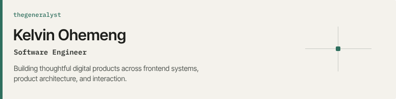

<!--
  Kelvin Ohemeng / thegeneralyst
  GitHub Profile README
-->

  

Software engineer focused on building thoughtful digital products across frontend systems, product architecture, and interaction.

---

## Selected Work

- [Anopa](https://github.com/kelvinohemeng/Anopa) — A source-available Shopify integration and commerce workflow for Framer.
- [Store](https://github.com/kelvinohemeng/store) — A full-stack ecommerce storefront with Next.js, Supabase Auth, CMS workflows, and Paystack checkout.
- [Eleventhspace SSR](https://github.com/kelvinohemeng/eleventhspace-ssr) — The current live Eleventhspace portfolio, built as a server-rendered design-engineering site.
- [3D Animate On Scroll](https://github.com/kelvinohemeng/3d-animate-on-scroll) — A scroll-driven 3D interaction prototype exploring motion, layout, and frontend animation craft.
- [Amahoro Message App](https://github.com/kelvinohemeng/Amahoro-message-app) — Event message capture experience for guests to submit reactions, questions, comments, and pledges.
- [Amahoro Message Display](https://github.com/kelvinohemeng/Amahoro-message-display) — Companion display app for presenting Amahoro event submissions across different live views.

---

## Core Stack

<table>
  <tr>
    <td><strong>Frontend</strong></td>
    <td>TypeScript, React, Next.js</td>
  </tr>
  <tr>
    <td><strong>Data & Commerce</strong></td>
    <td>APIs, Supabase, Firebase, Sanity, Shopify</td>
  </tr>
  <tr>
    <td><strong>Infrastructure</strong></td>
    <td>Cloudflare, Vercel</td>
  </tr>
  <tr>
    <td><strong>Interaction & Design</strong></td>
    <td>GSAP, Rive, Framer, Figma</td>
  </tr>
</table>

---

## Currently

- Rebuilding my portfolio around design engineering, full-stack product work, and CMS-driven case studies
- Sharpening the bridge between interaction design, frontend systems, and product architecture

---

## Open To

Software engineering roles · Frontend & design-engineering roles · Product-focused engineering · Select collaborations

---

## Elsewhere

[Portfolio](https://thegeneralyst.com) ↗ · [LinkedIn](https://www.linkedin.com/in/kelvinohemeng/) ↗ · [Contra](https://freelance.thegeneralyst.com) ↗ · [Email](mailto:kelvinohemeng59@gmail.com)
